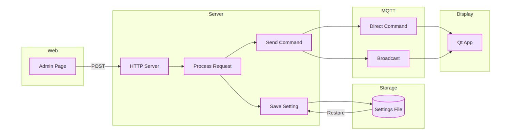

# CandyBarV2

A self-contained kiosk queue-number display system with web-based admin panel.



## Features

- **Queue Display**: Fullscreen Qt/QML display showing current queue numbers
- **Web Admin Panel**: Manage display from any device on the local network
- **Multi-language Support**: English, French, and Arabic with RTL support
- **Audio Announcements**: TTS-based number announcements
- **Customizable**: Fonts, colors, layouts, backgrounds, and logos
- **Persistent Settings**: All settings survive power loss
- **MQTT Integration**: Optional MQTT broker for distributed systems

## Tech Stack

| Layer | Technology |
|-------|------------|
| Display UI | PySide6 + QML (Qt 6) |
| HTTP Server | Python stdlib http.server |
| Messaging | paho-mqtt (MQTT) |
| Audio | pygame.mixer + edge-tts |
| Persistence | QSettings INI file |

## Quick Start

```bash
# First run (creates venv, installs deps, compiles resources)
./run

# Admin panel: http://<LAN-IP>:8080/admin
# Default PIN: 1234
```

## Project Structure

```
CandyBarV2/
├── app/                    # Main application
│   ├── main.py            # Entry point
│   ├── helper/            # Audio, persistence, networking
│   └── imports/app/qml/   # QML UI files
├── web/                    # Web admin panel
│   ├── server.py          # HTTP server
│   └── admin.html         # Admin UI
├── scripts/               # Utility scripts
├── resources/            # Audio files and assets
└── fluentui/             # Vendored UI components
```

## Documentation

See [CODEBASE.md](CODEBASE.md) for detailed technical documentation including:
- Data flow architecture
- DisplayState property reference
- File-by-file change guide
- MQTT topic structure
- Audio system details

## License

See LICENSE file for details.
